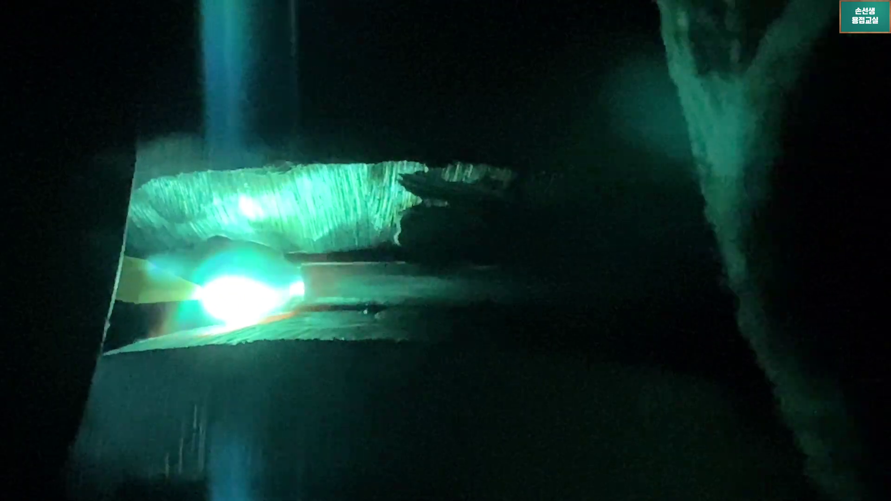

스테인리스 페르소나 질문과 답

## 사전 교육용 초보 질문 8개

1. 스테인리스 배관 용접 시, 칠판 강의에서 설명된 카본(탄소강) 대비 스테인리스강의 고유한 야금학적 금속 특성과 열팽창 특징은 무엇인가요?

스텐은 겉보기엔 번쩍이고 단단해 보여도, 용접할 때는 탄소강보다 한 백 배는 까칠하고 예민한 녀석이야. 야금학적 성질을 보면 스텐은 탄소강에 비해 열이 밖으로 퍼져나가는 '열전도율'이 약 3배나 낮아. 즉, 아크 열이 밖으로 못 빠져나가고 용접 부위 한 자리에 갇혀서 쇳물이 금방 과열되고 타버든다는 뜻이지. 반대로 온도가 오를 때 늘어나는 '열팽창률'은 탄소강보다 1.5배나 높아서, 조금만 열 조절을 잘못해도 조인트 틈새가 수축 인장력 때문에 오그라들고 삐뚤어져 단차 변형이 심하게 일어나는 무서운 물리적 성질을 가졌어.

2. 스테인리스 파이프 1차 백패스(빽비드) 시공 시, 칠판 강의에서 설명된 최적의 전류 세팅 기준은 탄소강과 비교하여 구체적으로 몇 % 정도 낮게 조절해야 하나요?

스텐 배관의 1차 루트패스 백비드를 낼 때는 탄소강 쏠 때랑 똑같은 생각으로 전류를 올렸다간 터치 즉시 구멍이 뻥 뚫리고 안쪽 백이 시커먼 숯덩이처럼 주저앉게 돼. 스텐은 낮은 용융 온도에서도 은근하게 스르륵 잘 녹아내리는 재질적 특성이 있어. 그래서 탄소강 파이프 백용접 시 사용하던 전류량보다 최소 30% 정도 낮은 전기 세기로 다운사이징하여 세팅해 줘야 해. 만약 카본 5G 루트패스를 90A로 쐈다면, 동일 Sch40 규격 of 스텐 파이프는 60~65A 선의 부드럽고 약한 전류에서 출발해 키홀을 아기자기하게 열고 나가는 게 기본 정석이란다.

3. 스테인리스 이면 백비드(빽비드)의 정교한 물결무늬 모양을 사수하기 위해, 용가재 와이어를 공급할 때 '끈적끈적한 느낌'과 '잘잘한 피치 간격'을 조절하라는 강사의 피딩 기법은 무엇을 의미하나요?

스텐 용접의 진정한 참맛은 파이프 내경 안쪽의 빽비드 모양이 겉 비드처럼 투명하게 다 보인다는 데 있어. 비드 모양을 한결같이 촘촘하게 살리려면, 용가재 와이어를 쇳물 풀 속에 푹푹 찌르며 흔들지 말고 와이어 끝단을 용융풀 가장자리에 끈적끈적하게 착 달라붙인 상태로 지그시 밀고 들어가는 끈적한 손끝 피딩을 유지해야 해. 이와 동시에 토치의 좌우 진행 피치(스윙 스텝) 폭을 아주 촘촘하고 잘잘하게 잘게 쪼개서 한 스텝씩 톡톡 밟아 올라가야 쇳물이 무겁게 주저앉지 않고 예술적으로 촘촘한 명품 빽비드 물결이 완성된단다.

4. 칠판 도면 강의에서 설명된 2차 핫패스(Hot Pass) 채움 단계 진행 시, 1차로 시공해 둔 백비드 배면이 녹아 손상되거나 안으로 빨려 들어가는 무서운 결함인 '백발리'란 구체적으로 무엇인가요?

배관 용접에서 초보자들을 가장 많이 좌절시키는 RT(방사선 검사) 불합격의 주범이 바로 이 '백발리' 결함이야. 1차 백패스로 안쪽에 예쁘게 빽비드를 잘 내놓았더라도, 그 위에 곧바로 2차 핫패스(살 채우기)를 덮어 씌울 때 아크 열이 너무 뜨겁게 고이게 되면 스텐 특유의 낮은 용융 온도 때문에 이미 굳어있던 1차 백비드 이면이 다시 녹아내려 버려. 이 녹은 쇳물이 중력이나 열 수축력에 의해 안쪽으로 빨려 들어가 오목하게 주저앉거나 숯처럼 까맣게 산화되어 그을리는 현상을 '백발리(백 데미지)'라고 불러.

5. 핫패스 주행 중 발생하는 '백발리'와 이면 산화 열적 데미지를 사전에 완전히 잠재우기 위해, 강사님이 제안한 와이어 지름(파이)의 얇은 규격 변경 원리는 무엇인가요?

이거 진짜 손선생 칠판 강의의 백미이자 특급 솔루션이야! 보통 백패스용으로 사용하던 두꺼운 2.4파이 와이어 대신 2.0파이(2.0T)의 더 얇은 와이어로 다운사이징하여 공급하는 요령이지. 얇은 와이어는 아크 열이 닿자마자 훨씬 빠르게 녹아들어 가면서 용가재 투입 속도와 양을 은근히 늘릴 수 있게 해줘. 이때 끊임없이 투입되는 차가운 와이어 자체가 모재에 누적되는 아크 고열을 직접 흡수하며 식혀주는 '냉각 핀(Cooling Pin)' 역할을 똑똑히 해내기 때문에, 1차 빽비드가 열을 받아 녹아내리는 온도를 비약적으로 차단해 백발리를 막아주는 원리야.

6. 2차 핫패스 적층 용접을 고속으로 질주할 때, 1차 백비드를 안전하게 수호하기 위해서 개선 사면 날개 턱 방향으로 어떻게 아크 불꽃을 뿌려주며 주행해야 하나요?

핫패스 용접을 할 때 토치 아크를 개선 홈 한가운데 정중앙에 대고 느릿느릿 비벼대면 열이 빽비드 중심으로 정통 집중되면서 뒷빽이 순식간에 녹아 터져버리지. 그래서 핫패스를 지나갈 때는 토치를 좌우 개선 사면(날개 벽) 턱 쪽으로 살살 롤링하여 열을 양 사면 쇠 부분으로 은근하게 흩어 분산시켜야 해. 그리고 홈 정중앙 빽비드 위를 통과할 때는 손목 스냅을 아주 날래고 신속하게 '고속 전진'으로 휙 긁고 지나가 아크 불꽃이 빽비드 한가운데에 단 0.1초도 멈춰 서 고열을 머금지 않도록 주행 속도 리듬을 신속하게 째주어야 한단다.

7. 스테인리스 배관 용접 시, 내부의 아르곤 퍼징(보호 가스) 기밀 상태는 최소한 몇 층(패스) 적층 작업 단계까지 계속 채워주고 유지하는 것이 철칙인가요?

스텐은 공기 중 산소를 조금만 만나도 시커먼 그을음 재(Sugaring)가 앉는 지독한 산화 결함이 나기 때문에 뒷면 보호 가스가 필수야. 용접 초기 1차 백패스(루트패스)를 할 때 팽팽하게 퍼징을 해두는 건 당연한 기본이고, 빽비드 뒷면에 직접적으로 아크 열 데미지가 닿는 2차 핫패스(Hot Pass) 주행 단계까지도 100% 무조건 퍼징 압력을 가득 기밀 유지하고 있어야 해! 현장에서 진정한 명품 무결점 배관을 만드는 진짜 고수들은 3차 중간 채움(필패스) 적층 단계까지도 퍼징 가스를 넉넉히 밀어 넣어 산소 침투율을 철저히 제로에 수렴하게 만든단다.

8. 다층 채움 용접인 3단계 필패스(Fill Pass)에 들어가기 전, 스텐 배관의 고온 열팽창과 산화로 인해 용융 쇳물이 가다가 턱에 턱턱 걸리는 현상을 방지하기 위한 '도로 정비' 요령이 무엇인가요?

스텐은 층을 쌓아 올릴수록 열이 고여 표면 산화막 스케일이 두껍게 앉는데, 이 지저분한 표면 위를 그냥 비벼버리면 아크가 불안정해지고 모재 가장자리 턱이 제대로 녹아들지 않아 융합 불량(LF) 하자가 백발백중 잠입하게 돼. 그래서 고수들은 필패스 아크를 대기 전에 와이어 브러시로 직전 비드 표면 스케일을 새하얗게 긁어 털어내고, 불규칙하게 튀어나온 가접 턱이나 비드 이음새 경계를 그라인더로 얇고 반듯하게 날려주는 '달려야 할 도로 정비'를 늘 사전 집행해. 그래야 다음 용융 쇳물이 걸림돌 없이 부드럽게 융착되며 미끄러지듯 주행할 수 있거든!

## 실전 문답용 질문 6개

1. 3단계 다층 채움 용접(필패스) 중 발생하는 융합 불량(LF)을 억제하고 스텐 특유의 예민한 표면 산화를 완전히 차단하기 위해 강사님이 칠판 강의에서 제시한 텅스텐 돌출 단축 조절 요령이 무엇인가요?

필패스를 올릴 때는 용융량이 많아지면서 모재 표면의 온도 상승이 엄청나기 때문에 가스 보호막인 실딩이 깨지면 비드가 순식간에 회색 재로 타버려. 이때 손선생 강사가 칠판에 빨간 펜으로 별표 치며 강조한 비법이 바로 세라믹 노즐 밖으로 튀어나오는 텅스텐 전극봉 끝단의 돌출 길이를 2~3mm 이내로 짧게 당겨 쓰는 단축 조작이야. 텅스텐 돌출이 짧아질수록 세라믹 컵에서 뿜어져 나오는 아르곤 가스의 직진 분사 밀도가 극대화되면서, 고온의 용융지 표면에 아주 진하고 단단한 공기 차단 아르곤 장막을 씌워 필패스 융합 불량(LF)과 산화 그을음을 완벽하게 잡아준단다.

2. 고온 캡패스(파이널 표면)에서 유독 극단적으로 요동치는 스텐 배관의 인장 수축 변형을 무마하기 위해 최종 비드를 납작하고 넓게 깔아주라는 비드 설계의 야금학적 원리는 무엇인가요?

스텐은 4단계 최종 마루판 캡패스에 도달하면 이미 빽, 핫, 필패스를 거치며 배관이 터지기 일보 직업으로 과열된 팽창 상태야. 이때 아크를 좁고 볼록하게 세워 올리면 식으면서 발생하는 스텐 고유의 강력한 인장 수축 스트레스가 한 지점으로 몰려 배관 쪼인 단차가 뒤틀리고 용접부가 찢어지는 대형 하자가 나. 이를 방어하려면 토치 세라믹 컵을 개선 턱 바깥 경계선까지 소폭 넓고 고르게 롤링 스윙하면서, 비드 높이를 얇고 납작하게 눕혀 넓게 분산 깔아주는 비드 설계를 집행해야 해. 쇳물을 얇고 넓게 펴 발라주어야 응력이 사방으로 고루 분산되어 수축 뒤틀림을 안전하게 흡수할 수 있거든!

3. 스테인리스 표면 파이널 비드가 은백색(Silver)이나 황금색(Gold)이 아닌 까맣고 푸르스름하게 타들어 가는 '흑회색 탄화 변색'의 근본적인 원인은 무엇인가요?

스텐 파이널 비드가 까맣게 타 죽은 석탄처럼 나오는 이유는 100% 용접사의 이동 속도가 너무 느려서 모재가 견딜 수 있는 임계 온도 범위를 초과하는 과도한 열 입력(Heat Input)이 축적되었기 때문이야. 여기에 한술 더 떠서 아크 종료 스위치를 끄자마자 토치 컵을 하늘로 휙 떼어버리면, 여전히 500도 이상으로 시뻘겋게 달아오른 비드가 공기 중 산소와 터치하며 시커먼 회색 산화 스케일로 바싹 구워지지. 전류 세기를 약 10% 낮추거나 손가락 스냅 롤링 등속 속도를 빠르게 째서 전진 보폭을 올리고, 후기가스가 5~8초간 흐를 때까지 토치를 마감부에 그대로 대고 식혀주는 정성이 필요해.

4. 스텐 핫패스 단계에서 2.4파이 와이어 대신 2.0파이 와이어를 사용해 용가재 투입 속도와 빈도를 늘려 아크 열을 식혀주는 '레이와이어(Lay-Wire)' 공급의 실전 피딩 리듬감은 어떠해야 하나요?

스텐 핫패스에서 2.0파이 얇은 와이어를 쓸 때는 탄소강 빽 쏘듯이 쑥쑥 밀어 넣고 당기는 펌핑 피딩(백비쉬)을 하면 얇은 봉이 금방 아크 불꽃에 녹아 뭉쳐 튕겨 나가버려. 와이어 끝단을 개선 홈 틈새 바닥에 살포시 얹어 밀착시킨 상태에서, 토치 진행 속도와 일치하게 와이어를 용융풀 맨 앞 경계면에 대고 미끄러지듯 스르륵 슥슥 연속으로 부드럽게 밀어 주는 '레이와이어 밀착 피딩' 리듬을 가야 해. 와이어가 아크 열을 받아 스르르 풀리며 쇳물 속으로 빨려 들어가는 끈적한 유기적 싱크로율을 몸에 체득하는 것이 고수 반열의 필수 코스야.

5. 최종 캡패스 용접이 완료된 후, 비드 표면이 마치 로봇이 짠 것처럼 매끄럽고 일정한 피치 간격을 띠면서도 텅스텐 찍힘(오염)을 원천 방지하기 위해 세라믹 노즐 컵을 개선 턱에 마찰 지탱하는 요령이 무엇인가요?

서스는 캡패스 시 파이프 표면에 세라믹 노즐 컵을 직접 비비며 전진하는 롤링을 펼치는데, 표면이 매끄러워 컵이 미끄러지는 순간 텅스텐 끝이 용융지에 쾅 찍혀 박히는 RT 불합격 오염 사고가 단골로 터지지. 이를 막으려면 토치 자루를 쥔 새끼손가락 마디를 파이프 표면에 미끄럼 방지용 단단한 지지 기둥(앵커)으로 가볍게 딛고, 노즐 컵 모서리를 개선 턱 홈 골짜기 사이에 반쯤 걸친 안정적인 걸침 셋업을 요구해. 팔뚝 힘으로 토치를 억지로 비틀지 말고, 새끼손가락 앵커를 중심으로 손목 관절 마디의 미세 마찰 굴림 스냅만으로 토치를 전진 회전시켜 가야 기계처럼 반듯하고 일정한 롤링 비드가 탄생한단다.

6. 칠판 도면 강의 3단계에서 설명된 '필패스 시 쇳물 높이를 파이프 외경 턱보다 약 0.5~1.0mm 정도 살짝 낮게 남겨두고 채우는 것'이 최종 파이널 캡패스 품질을 좌우하는 결정적인 이유는 무엇인가요?

스텐 다층 채움 필패스를 돌릴 때 개선 턱 홈 위까지 쇳물을 뚱뚱하게 꽉꽉 채워 버리면, 마지막 4단계 얼굴인 캡패스(파이널) 토치 롤링을 돌릴 때 세라믹 노즐 컵이 물고 갈 좌우 가이드 개선 턱이 다 녹아 묻혀 사라져 버려. 컵이 지나갈 궤적 홈이 없으니 노즐 컵이 쇠 위에서 겉돌고 삐져나가 비드 줄이 사정없이 뒤틀려 삐뚤삐뚤 엉망이 되지. 마지막 캡패스를 기계가 짠 것처럼 곧고 반듯하게 올리려면, 필패스 단계에서는 쇳물을 모재 외경 턱 경계선보다 눈곱만큼(약 0.5~1mm) 살짝 낮고 평평하게 남겨두어 세라믹 컵이 안전하게 미끄러져 갈 '레일 가이드 턱'을 남겨두는 센스가 꼭 필요하단다!

## 영상 캡쳐 사진 보고 할 질문 3개 -> 질문용 사진.png

1. 캡쳐된 실전 TIG 용접 영상 사진을 보면 강렬한 에메랄드빛 아크 광이 상하 모재 사이의 루트 갭을 비추고 있습니다. 이 사진은 외부가 아닌 배관 내부(이면)에서 백비드(빽비드) 시공 과정을 촬영한 실시간 모니터링 화면입니다. 이 내부 카메라 뷰의 특성을 고려할 때, 용접 중 쇳물이 아래로 주저앉거나 끊기지 않고 고르고 도톰한 이면 백비드(빽비드)를 완벽하게 안착시키기 위해 용접사가 토치 전면의 아크 압력과 용융풀(쇳물 풀) 열 입력을 어떻게 제어해야 하는지 설명해 주세요.

사진 속 장면은 스테인리스 배관 용접의 가장 중요한 첫 단추인 **1차 루트패스 백패스(빽비드) 시공** 상황을 파이프 **내부(이면)에 설치된 특수 카메라**로 실시간 모니터링하고 있는 실제 화면이란다. 상하로 비치는 거칠거칠한 세로 줄무늬는 파이프 개선면의 **루트 면(Root face)**이고, 좌측에서 뿜어져 나오는 강렬한 아크 광이 어두운 내부 공간을 밝히고 있지. 이 내부 모니터링 뷰에서 균일한 백비드를 안정적으로 밀어내려면, 아크 압력과 용융지의 열을 귀신같이 가둬 다스려야 해. 스텐은 열전도율이 낮아서 한곳에 머무르면 열이 갇혀 쇳물이 푹 주저앉거나 뚫리기 쉬우니, 아크 압력을 이용해 쇳물을 갭 안쪽(내부)으로 부드럽게 밀어 올리듯 등속으로 주행해야 한단다. 또한, 토치 스윙 시 홈 정중앙에서는 0.1초도 멈추지 않고 신속히 긁고 지나가면서 좌우 루트 면 턱에만 가볍게 열을 나누어 주는 영리한 롤링 템포를 지켜야만 중력에 굴하지 않는 매끄러운 이면 빽비드가 탄생한단다!

2. 사진 좌측의 눈부신 아크 광 바로 옆을 자세히 보면, 루트 갭을 관통하여 파이프 내부로 비스듬히 돌출되어 들어와 있는 노란색/연두색의 뾰족한 실루엣이 보입니다. 이 뾰족한 물체의 정확한 기술적 명칭을 제시하고, 1차 루트패스 시공 시 이 물체의 돌출 길이와 각도 제어가 내부 백비드(빽비드) 형성과 이면 용융풀 안착에 미치는 결정적인 물리적 역할과 관리 요령을 설명해 주세요.

많은 사람들이 사진 좌측에 비스듬히 튀어나온 뾰족한 실루엣을 용가재 와이어라고 착각하기 쉬운데, 이건 와이어가 아니라 파이프 외부 TIG 토치에서 루트 갭(틈새)을 뚫고 내부로 1.5~2.0mm가량 관통해 들어온 **텅스텐 전극봉(Tungsten Electrode) 끝단**이란다! TIG 용접은 밖에서 세라믹 노즐이 홈을 덮고 지나가기 때문에 밖에서는 전극봉이 절대 안 보이지만, 이 내부 모니터링 화면에서는 전극봉 끝이 갭을 뚫고 나온 웅장한 모습이 이렇게 선명하게 관찰되지. 1차 백비드를 낼 때 이 텅스텐 전극봉의 '돌출 길이(돌출도)'는 빽비드 형성에 절대적인 영향을 미친단다. 전극봉 돌출이 너무 얕으면(1mm 이하) 아크 열이 파이프 내부 루트 면까지 닿지 않아 빽이 나오지 않는 '미용융' 하자가 나고, 반대로 너무 깊게 돌출되면(2.5mm 이상) 내부에서 들어오는 용가재 와이어나 용융풀 쇳물에 텅스텐 끝이 쾅 찍혀 박히는 '텅스텐 혼입(오염)' 대형 RT 불합격 하자가 터져버려. 그렇기 때문에 갭 중심(센터)에 텅스텐 전극봉을 한 치의 흔들림 없이 정렬한 상태에서, 돌출 길이를 1.5~2.0mm 수준으로 일정하게 유지하며 토치를 굴리는 정밀한 손목 통제력이 핵심 중의 핵심이란다!

3. 사진을 보면 눈이 멀 것 같은 아크 불빛 속에서도 용융풀과 위아래 모재 개선면의 가공 결(루트 면)이 선명한 에메랄드(초록) 빛 시야로 뚜렷하게 식별됩니다. 또한 우측에는 어둡고 거대한 수직 실루엣이 원근감을 띠며 화면을 채우고 있습니다. 이 녹색 화면을 구현하는 모니터링 장비의 원리와 우측에 흐릿하게 잡힌 거대한 실루엣의 정체를 기술적으로 설명하고, 용접사가 이 실시간 화면을 보며 용접 품질을 확인하는 모니터링 포인트를 설명해 주세요.

이 신비롭고 강렬한 에메랄드빛 화면은 용접사가 현장에서 눈으로 직접 보는 모습이 아니라, **파이프 내부 카메라 렌즈에 장착된 용접 관찰 전용 특수 그린 차광 필터(Bandpass/ND filter)**가 만들어낸 고도화된 기술적 시야란다. 아크에서 뿜어 나오는 살인적인 눈부심 광원을 특수 필터가 싹 걷어내 주기 때문에, 눈부심 없이 텅스텐 전극봉 끝단과 쇳물이 양쪽 루트 면(위아래에 비쳐 보이는 조밀한 세로 줄무늬)을 균일하게 갈가리 녹이고 들어가는 경계선을 이토록 선명하게 확인할 수 있는 것이지. 그리고 우측에 있는 어둡고 거대한 녹색 기둥 모양의 정체는 바로 **둥글게 휘어져 나가는 파이프의 안쪽 벽면(내경 벽)**이란다! 내부 좁은 공간에서 초광각 카메라가 비스듬히 촬영하다 보니, 렌즈와 가까운 둥근 파이프 내벽이 흐릿하게 원근감을 띠며 큰 벽처럼 잡힌 것이지. 용접사는 이 실시간 내부 화면을 모니터링할 때 3가지 골든 포인트를 봐야 해. 첫째, 텅스텐 전극봉이 루트 갭 정중앙에 잘 정렬되어(Centering) 주행하는가, 둘째, 위아래 모재의 루트 면이 칼로 벤 듯 좌우 대칭으로 똑같이 녹아들고 있는가, 셋째, 형성된 쇳물이 틈새로 부드럽게 밀려 나와 굳어가고 있는가란다. 이 모니터링 감각을 마스터하면 육안을 뛰어넘는 신의 영역에서 완벽한 무결점 빽비드를 창조해 낼 수 있단다!