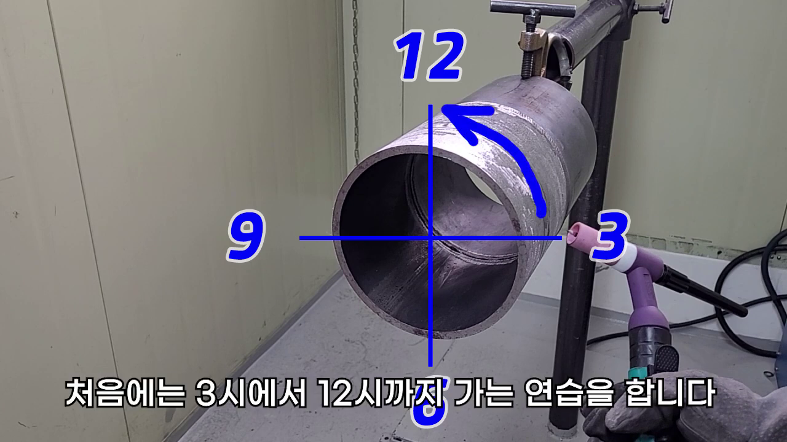

탄소강 페르소나 질문과 답

## 사전 교육용 초보 질문 8개

1. 탄소강 5G 용접 전에 파이프 표면에 균일한 용접선 가이드라인을 그릴 때 사용하는 롤백바(마킹 테이프)의 두 가지 사용 방법과 특징이 무엇인가요?

파이프 표면에 예쁜 비드 줄을 뽑으려면 눈으로 쫓아갈 명확한 기준선이 필수적인데, 이때 현장에서 흔히 '롤백바'라고 부르는 마킹 테이프를 쓴단다. 사용 방법은 크게 두 가지로 나뉘어. 첫 번째는 파이프 둘레를 따라 둥글게 둘러싸듯이 감아 원형 선을 마킹하는 방법이고, 두 번째는 배관 축 방향을 따라 길게 평행하게 가이드라인을 긋는 방법이지. 두 방법 중 어느 쪽이 정답이라고 할 수는 없고, 본인의 작업 스타일이나 손목 꺾임에 따라 더 편한 방식을 선택해 그리면 돼. 초보자들은 파이프 원주를 고르게 타는 둥글게 말아주는 감기가 손목 방향 잡기에 훨씬 안정적일 거야!

2. 마킹 테이프로 가이드라인을 예쁘게 그린 다음, 왜 커터칼 날을 사용해서 그 선을 따라 미세하게 금을 내주는 스크래치 작업을 추가로 하는 건가요?

이거 정말 사소해 보이지만 현장에서 고수들이 절대 빼먹지 않는 알짜배기 팁이야! 용접을 시작해서 강한 아크 불꽃과 자외선 빛이 터지기 시작하면, 펜으로 칠해 둔 일반 매직 선이나 마킹 펜 자국은 눈부신 광장에 묻혀서 전혀 보이지 않게 돼. 이때 커터칼 날로 가이드라인을 따라 미세하게 흠집 홈을 내두면, 아크 불빛이 그 칼날 자국 틈새에 반사되면서 얇게 빛나는 은백색 가이드라인 실선이 안전 투구 렌즈 너머로 선명하게 도드라져 보인단다. 이 반짝이는 칼선을 등대 삼아 토치를 주행해야 삐뚤어지지 않고 반듯한 일자 비드를 곧게 얻을 수 있어.

3. 5G 상진(위로 올라가는) 용접 훈련을 처음 들어갈 때, 왜 까다로운 6시 하단 스타트부터 배우지 않고 비교적 쉬운 3시 측면 지점부터 위빙 연습을 하라고 권장하나요?

5G 자세는 배관이 수평으로 고정된 상태라서 중력이 쇳물을 밑으로 사정없이 끌어내리기 때문에 난이도가 최상급이야. 특히 6시 완전 바닥은 머리 위에 배관이 매달린 오버헤드 상태라 자세가 억지로 꺾이고 쇳물이 툭 떨어져서 초보자들이 백발백중 텅스텐을 찍거나 멘탈이 나가버려. 그래서 비교적 시야 확보가 쉽고 토치 컵 롤링 각도를 꼿꼿이 세워 밀착 주행할 수 있는 '3시 측면 구간'부터 연습을 시작해 손목 스냅 감각을 먼저 정교하게 뇌에 새긴 뒤, 점진적으로 아래 경사각으로 내려가는 것이 훨씬 실패율이 낮은 최고의 우회 전술이란다.

4. 3시 측면 구간에서 5G 운봉 연습을 할 때, 손목 스냅을 옆으로 둥글게 흔드는 위빙과 일자로 툭툭 튕기며 밀고 나가는 일자 진행 위빙 중 초보자에게 어떤 방법이 더 적합한가요?

정답을 말해주자면 "둘 다 귀신같이 해낼 수 있어야 해!" 파이프 배관은 둥근 구체를 타고 올라가기 때문에 한 가지 손목 궤적만 고집해서는 절대 통과할 수 없어. 옆으로 살살 롤링하며 폭을 널찍하고 촘촘하게 메우는 위빙은 살을 도톰하게 채우는 필패스나 표면 마감에 유리하고, 아크 압력으로 일자로 쭉쭉 밀며 주행하는 운봉은 초입 스타트나 일정한 비드 물결을 안정적으로 깔고 가는 데 유리하지. 두 가지 운봉법 모두 마킹된 커터칼 선 위에서 미끄러짐 없이 일정하게 움직이도록 몸에 익히는 게 핵심이야.

5. 실제 5G 상진 주행 실물 용접 연습 시, 6시 정하부 대신에 5시 방향에서 시작해서 12시 꼭대기 마루판까지 아크를 끌고 올라가며 훈련하는 장점은 무엇인가요?

6시 완전 바닥은 어깨와 팔꿈치가 완전히 파이프 밑으로 기어들어가 용융풀 가장자리를 확인하기 어려운 사각지대야. 반면 5시 방향은 살짝 비껴선 측하부 구간이라 초보도 고개를 조금만 돌리면 쇳물이 끓는 용융풀 모양을 눈으로 똑바로 쫓아갈 수 있어! 5시에서 안정적으로 출발하여 12시 마루판까지 흔들림 없이 토치 롤링 속도를 등속으로 뽑아내는 훈련이 완전히 100% 손에 익고 나면, 그때 손목 시작점을 서서히 아래로 내려 6시 오리지널 스타트를 공략하는 것이 훨씬 실패율이 낮은 최고의 우회 전술이란다.

6. 5시에서 12시로 상진 비드를 촘촘히 쌓으며 전진 주행할 때, 용융풀이 도중에 굳거나 끊기지 않고 자연스럽게 이어지도록 하는 용가재 와이어의 '최소 송급' 요령이 궁금합니다.

초보자들이 가장 많이 저지르는 실수가 뭐냐면, '비드를 두껍게 쌓아야지' 하고 욕심을 내서 용가재 와이어를 아크 중심 속으로 무턱대고 쑥쑥 밀어 넣는 거야. 그러면 순간적으로 쇳물이 비대해지면서 무거워져 아래로 쏟아지거나 아크 전압이 출렁여서 용융풀이 굳고 비드 물결이 툭 끊겨버려. 와이어는 먹여 넣는 게 아니라 용융풀 맨 앞쪽 코너 자락에 살포시 얹는 느낌으로 최소한만 톡톡 얹어줘야 해. 쇳물의 표면 장력이 와이어를 스스로 녹여서 빨아들이게끔 최소 유량 공급 밸런스를 유지해 줘야 비드 폭이 균일하고 예쁘게 살아난단다.

7. 개인 연습 공간이나 책상 클램프를 사용해 5G 연습 모재를 조립할 때, 학원 정렬 지그가 없는 상태에서 평철에 파이프를 고정하여 튼튼한 자가연습대를 만드는 순서가 어떻게 되나요?

비싼 전문 학원용 지그가 없어도 머리만 쓰면 집에서도 얼마든지 훌륭한 5G 연습장을 차릴 수 있어. 먼저 평평하고 단단한 쇳조각 평철판을 베이스로 준비해. 그 위에 3인치나 4인치 연습용 파이프 모재를 수직으로 똑바로 세워 올린 뒤, 좌우 뒤틀림이 없도록 가접(테크)을 동서남북 사방에 얇고 단단하게 한 방씩 놔줘. 이 평철판 베이스를 인터넷에서 만원 안팎이면 사는 '만력기(클램프)'로 책상이나 쇠받침대 모서리에 흔들림 없이 꽉 물려 고정해두면, 흔들림 없는 완벽한 나만의 5G 전용 자가연습대가 뚝딱 완성되지!

8. 책상 클램프에 고정한 자가연습대에서 토치 세라믹 컵을 파이프 외경에 대고 롤링할 때, 매끄러운 파이프 표면 때문에 컵이 삐걱거리며 자꾸 옆으로 미끄러져 스냅이 풀리는 현상은 어떻게 방지하나요?

이거 진짜 연습장에선 아무도 안 가르쳐주는 김 반장의 특급 처방이야! 갓 깎아낸 쇠 파이프 표면은 반질반질하고 매끄러워서 토치 세라믹 노즐 컵이 마찰력을 잃고 툭 미끄러져 텅스텐 끝으로 파이프를 찍어버리기 십상이지. 이럴 땐 문방구에서 파는 노란색 '종이테이프(마스킹 테이프)'를 세라믹 컵이 구를 파이프 롤링 경로를 따라 한 바퀴 예쁘게 슥 감아줘! 종이테이프의 오돌토돌한 표면이 세라믹 노즐과 강력한 마찰 지지대를 형성해 주면서, 노즐이 미끄러지지 않고 톱니바퀴 맞물리듯 착 달라붙어 예술적인 등속 손목 롤링 스냅이 쫙쫙 감기게 된단다.

## 실전 문답용 질문 6개

1. 5G 탄소강 파이프 3시~9시 측면 위로 올라가는 상진 운봉 시, 좌우 스윙 속도 조절 템포를 개선 턱 양끝과 홈 가운데에서 어떻게 각기 쪼개어 제어해야 비드 처짐과 언더컷을 방지하나요?

5G 상진 구간은 쇳물이 중력 때문에 항상 뒤로 쳐져 쏟아지려는 최전선이라 위빙 롤링의 템포 쪼개기가 생명이야. 토치 세라믹 컵을 굴릴 때, 가운데 벌어진 루트 홈 중앙 영역은 절대로 머뭇거리지 말고 '휙' 하니 전속력으로 신속하게 흘려보내야 해. 중심부에 쇳물이 고이기 시작하면 바로 처지거든. 반대로 좌우 개선 사면 턱 양끝 경계선에 도달했을 때는 용가재와 철판 모재가 은근히 녹아 쇳물 풀이 좌우 벽면에 착 달라붙을 수 있도록 약 0.2초에서 0.3초간 '탁-탁' 멈춰 서는 정지 홀딩(Hold) 템포를 셋업해 줘야 해. 이 '탁-휙-탁-휙' 리듬감이 완벽해야 가장자리가 골짜기처럼 파먹는 언더컷 결함이 안 난단다.

2. 실제 13번 영상 5시 상진 주행 장면을 보면 강사님이 용융풀 상태를 유지하며 12시 방향 꼭대기까지 전진하는데, 5G 상진 용접 중 용융풀이 넓게 퍼지지 않고 또렷하게 집중되도록 유도하는 미세 아크 길이 통제 노하우가 무엇인가요?

초보자들이 5G 상진을 할 때 아크 불꽃이 눈부시고 무섭다 보니 토치를 파이프 표면에서 2~3mm 이상 멀찍이 떼고 주행하는 경우가 태반이야. 아크 거리가 멀어지면 아크 전압이 뛰면서 열이 주변으로 벙벙하게 넓게 퍼지고 쇳물 풀이 비대해져서 비드가 아래로 질질 처지게 돼. 아크 길이는 텅스텐 끝단에서 쇳물 표면까지 1.0mm에서 최대 1.5mm 미만으로 극도로 짧고 날카롭게 바짝 밀착 유지해야 해. 아크 불꽃을 총알 기둥 모양으로 예리하고 좁게 가둬 찔러줘야, 아크의 강한 직진성 압력이 쇳물을 갭 속으로 수직 밀어 올려 처짐 없이 고르게 안착시킬 수 있어.

3. 13번 영상 세그먼트 4에서 설명된 '종이테이프 감기' 특급 팁을 실전에서 적용할 때, 본용접 시 아크 열기에 종이가 타 들어가며 발생할 수 있는 이물질 유입 결함을 방지하려면 어떤 거리 안전 규격을 준수해야 하나요?

종이테이프를 파이프 표면에 감는 건 세라믹 컵의 롤링 지지대(마찰 앵커)를 확보하기 위한 임시 가이드라인 목적이라, 본용접 아크 열기가 직접 닿는 개선 틈새 바로 근처까지 종이를 둘러버리면 절대 안 돼! 아크의 고열에 노란 종이테이프가 타들어가며 시커먼 그을음과 탄소 불순물 가스가 뿜어져 나와 쇳물 풀 속으로 쏙 빨려 들어가면 기공(Blowhole)이나 흑색 슬래그 박힘 하자가 직방으로 생기거든. 반드시 실제 용접 홈 개선 에지 경계선으로부터 최소 15mm 이상 떨어진 안심 안전 거리를 비워두고 외곽 뒤쪽에만 테이프를 둘러주는 게 철칙이야.

4. 13번 비디오 세그먼트 2에서 커터칼 날로 파이프 가이드를 그은 뒤 진행하는 3시 위빙 훈련 시, 용접사의 시선(Eye control) 처리는 텅스텐 전극봉 끝과 가이드 실선 중 어디에 머물러야 일자 직진도가 완벽하게 유지되나요?

초보자들이 가장 많이 실수하는 것 중 하나가 눈길을 텅스텐 끝이랑 아크 파란 불꽃 정중앙에만 고정하고 멍하니 쫓아가는 거야. 그러면 시야가 좁아져서 손목이 서서히 돌다가 가이드라인 밖으로 삐져나가 비드가 뱀처럼 뒤틀리게 돼. 고수들은 "손보다 눈이 늘 먼저 마중 나가 있어야 한다"라고 말해. 시선은 토치 끝 전극봉을 따라가는 게 아니라, 내가 앞으로 갈 길인 세라믹 컵 2~3mm 앞쪽에 선명하게 반짝이는 커터칼 흠집 가이드 실선을 멀리 넓게 쫓아가며 손목 롤링 피치를 마찰 리듬에 맞춰 굴려줘야 자로 잰 듯 똑바른 기계 같은 일자 비드가 쫙 뽑혀 나와.

5. 평철 두 개를 45도 V형 각도로 가접해 자가 6G 연습대를 만드는 고난도 훈련 시, 파이프 하단 6시 경사 구간에서 중력에 의해 쇳물이 아랫벽 사면으로 쏟아지는 하자를 제어하는 토치 타격각 조정 팁이 무엇인가요?

45도 기울어진 6G 자세 연습대에서는 중력이 수직으로 아래쪽 사면에만 100% 작용해서, 쇳물이 아래쪽 개선벽으로 뚱뚱하게 뭉쳐 흐르고 위쪽 개선벽은 녹지 않는 비대칭 불량이 백발백중 터지지. 이때는 토치의 타격 각도를 배관 중심 축보다 위쪽 개선 벽면을 향해 약 5도에서 10도 정도 바짝 틀어 쏘아올리는 전향적 각도 교정이 필요해. 아크 불꽃의 지향 압력과 가스 뿜는 바람 힘을 이용해 아래로 흐르는 쇳물을 억지로 멱살 잡고 위쪽 턱으로 쓸어 올리는 스냅 느낌으로 롤링을 조작해 주어야 비로소 좌우 대칭이 맞는 예쁜 도톰한 경사 비드가 만들어진단다.

6. 3인치/4인치 Sch40 배관 5G 상진 용접 시, 3시 오르막길에서 12시 꼭대기 하향 아래보기 마감 지점에 진입할 때 쇳물 처짐과 비드 넓어짐을 막기 위한 등속 전진 가속화 노하우를 가르쳐주세요.

파이프의 최정상 마루판인 12시 구간은 앞서 5시부터 온갖 잔열을 받으며 주행해 올라왔기 때문에 모재 전체가 벌겋게 달아오른 최과열 상태야. 여기서 3시나 5시 때 굴리던 느긋한 리듬 템포를 그대로 고집하면 열이 갇혀서 쇳물이 양옆으로 넙데데하게 퍼지고 파이프 내부 빽이 쏟아져 함몰(Suck-back)이 오게 돼. 12시 마루 마감선에 진입하기 시작하면 어깨에 힘을 빼고, 토치 진행 속도를 평소보다 최소 1.3배에서 1.5배가량 과감하고 빠르게 등속으로 비비며 전진 보폭을 가속해 줘야 해. 쇳물이 열을 받아 퍼지기 전에 빠르게 스냅으로 긁고 마감선을 쳐야 납작하고 촘촘한 명품 캡비드가 마감된단다.

## 영상 캡쳐 사진 보고 할 질문 3개 -> 질문용 사진.png

1. 캡쳐된 탄소강 3시 위빙 훈련 사진 속 토치를 보면 세라믹 노즐 컵이 파이프 가이드 표면에 착 밀착되어 회전 롤링 중인데, 이때 노즐이 뒤로 눕지 않고 안정적인 손목 스윙을 유지하기 위한 밀착 누름 강도는 어느 정도가 가장 적당한가요?

사진 속을 보면 세라믹 노즐 컵 두 가장자리 테두리가 파이프 쇠 표면에 아주 얌전하게 밀착되어 롤링의 지지점을 잡고 있지. 이때 초보자들은 토치가 흔들릴까 봐 온 힘을 다해 개선 턱을 꾹 누르며 토치를 굴리는데, 그러면 컵이 쇠에 뻑뻑하게 끼어 삐걱거리며 튕겨 나가고 전진 주행 피치가 다 일그러져 버려. 힘을 잔뜩 뺀 상태에서, 세라믹 컵의 둥근 모서리가 배관 표면에 가볍게 스치듯 얹혀 있는 느낌으로 롤링 마찰을 지탱해야 해. 마찰력만 확보되면 토치 자체 무게와 손목 스냅 관절 리듬만으로 스르륵 스무스하게 컵이 굴러갈 수 있는 부드러운 힘 빼기 밸런스가 최고야.

2. 사진 상의 3시 지점에서 용가재 와이어를 공급하지 않고 토치 롤링만 슥슥 굴려 나가는 '공토치(Dry Run) 위빙' 훈련을 아크를 켜기 전에 먼저 시행하는 구체적인 훈련 목적은 무엇인가요?

용접 아크 불꽃이 눈앞에서 시뻘겋게 터지기 시작하면 초보자들은 잔뜩 겁을 먹고 온몸의 근육과 손목이 돌처럼 딱딱하게 굳어버리기 십상이야. 그래서 아크를 대지 않은 공토치 상태에서, 커터칼로 정밀하게 긁어놓은 3시 가이드 실선을 따라 세라믹 노즐을 일정한 보폭과 높이로 부드럽게 굴려 나가는 '드라이 런' 손목 근육 적응 훈련을 반복 집행하는 거지. 눈감고도 토치가 파이프 원주 곡선을 따라 일정한 속도와 각도로 전진할 수 있도록 손목 관절에 궤적의 길을 미리 닦아두어야, 나중에 아크를 켜고 와이어가 들어와도 흔들림 없는 칼비드를 뽑아낼 수 있어.

3. 사진 속 토치 세라믹 컵 바로 앞쪽 파이프 쇠 표면에 커터칼 날로 긁어둔 얇은 은백색 스크래치 선이 뚜렷하게 관찰됩니다. 눈부신 아크 불꽃 광원 아래에서 이 실선 가이드를 시선으로 놓치지 않고 안정적으로 끝까지 리드해 가는 비결이 무엇인가요?

용접 가면 안전 차광 렌즈를 쓰고 아크 불꽃을 째면 까만 어둠 속에서 오직 파란 용융풀과 불꽃만 동그랗게 보여서 그냥 매직 펜으로 그려둔 검은 선은 다 타서 증발하거나 빛에 가려 보이지 않게 되지. 하지만 커터칼 날로 철판 표면을 긁어 쇠알갱이를 얇게 파내어 둔 이 실선 홈은, 아크 불빛이 비치는 순간 그 파여진 틈새 사이로 은백색 자외선 광선이 반사되면서 은하수처럼 반짝반짝 빛나는 얇은 야광 선으로 뚜렷하게 도드라져 보여! 텅스텐 끝부분만 노려보지 말고, 그 반짝이는 칼선 야광 흔적을 눈으로 약 5mm 앞서 마중 나가며 시선을 등대 삼아 토치를 유도해 밀고 가면 한 치의 뒤틀림도 없이 일자로 곧게 주행할 수 있단다.
